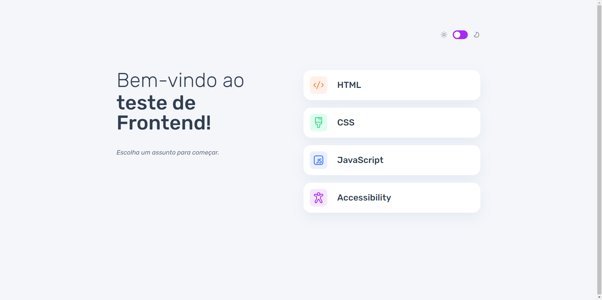

# Aplicativo de teste de frontend

Aplicativo web de teste de conhecimentos sobre assuntos relacionados ao desenvolvimento front-end.

## Índice

- [Visão geral](#visão-geral)
   - [O desafio](#o-desafio)
   - [Captura de tela](#captura-de-tela)
   - [Links](#links)
- [Meu processo](#meu-processo)
   - [Construído com](#construído-com)
- [Autor](#author)
- [Projeto](#projeto)


## Visão geral

### O desafio

Os usuários devem ser capazes de:

- [x] Selecione um assunto do questionário
- [x] Selecione uma única resposta de cada pergunta entre quatro opções
- [x] Veja uma mensagem de erro ao tentar enviar uma resposta sem fazer uma seleção
- [x] Veja se eles fizeram uma escolha correta ou incorreta ao enviar uma resposta
- [x] Passe para a próxima pergunta depois de ver o resultado da pergunta
- [x] Veja um estado concluído com a pontuação após a pergunta final
- [x] Jogue novamente para escolher outro assunto
- [x] Veja o layout ideal da interface dependendo do tamanho da tela do dispositivo
- [x] Veja os estados de foco e foco para todos os elementos interativos na página
- [x] Navegue por todo o aplicativo usando apenas o teclado
- [x] Altere o tema do aplicativo entre claro e escuro

### Captura de tela



### Links

- URL da solução: [Repositótio Projeto](https://github.com/Samuel-Amaro/quiz-frontend)
- URL Resultado: [Resultado](https://quiz-frontend-blue.vercel.app/)

## Meu processo

### Construído com

- Semantic HTML5 markup
- CSS(Flex-Box, Grid, Normalize)
- Mobile-first workflow
- Responsive Web Design
- Acessibility
- TypeScript
- API Web LocalStorage
- Svelte
- SvelteKit

## Author

- Site - [Samuel Amaro](https://meu-portfolio-topaz-alpha.vercel.app/)
- Frontend Mentor - [@samuel-amaro](https://www.frontendmentor.io/profile/samuel-amaro)

## Projeto 

### Criado um projeto

como criar um novo projeto sveltekit

```bash
# cria um novo projeto no diretório atual
npm create svelte@latest

# cria um novo projeto em my-app
npm create svelte@latest my-app
```

### Desenvolvimento

Depois de criar um projeto e instalar dependências com `npm install` (ou `pnpm install` ou `yarn`), inicie um servidor de desenvolvimento:

```bash
npm run dev

# ou inicie o servidor e abra o aplicativo em uma nova aba do navegador
npm run dev ---open
```

### Building

Para criar uma versão de produção do seu aplicativo:

```bash
npm run build
```

Você pode visualizar a compilação de produção com `npm run preview`.

Para implantar seu aplicativo, pode ser necessário instalar um [adaptador](https://kit.svelte.dev/docs/adapters) para seu ambiente de destino.

### Scripts

#### Format, Lint, Check

Formatar o código (Prettier)

```bash
npm run format
```

---

Executar o Lint

```bash
npm run lint
```

---

Executar a verificação do Svelte

```bash
npm run check #or
npm run check:watch
```